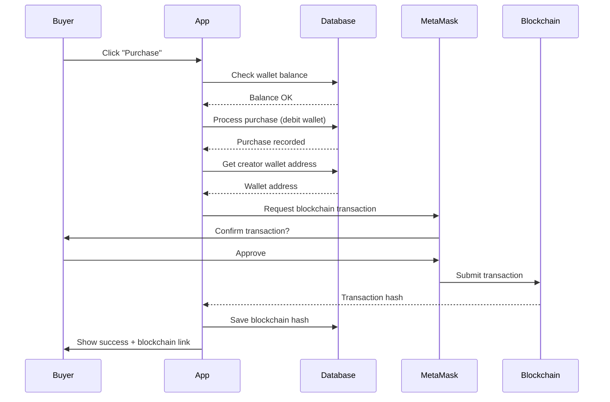

# Blockchain Integration Setup Guide

## Overview
Your application has a complete blockchain integration for transparent creator payouts and premium purchases. This guide will help you deploy and configure the blockchain features.

## Features Implemented

✅ **Smart Contract** - Records premium purchases on Polygon/Ethereum testnet  
✅ **MetaMask Integration** - Users can connect crypto wallets  
✅ **Blockchain Transaction Recording** - All premium purchases can be recorded on-chain  
✅ **Transaction Hash Display** - Blockchain verification links shown in purchase confirmations  
✅ **Creator Wallet Management** - Creators can link their wallet addresses  
✅ **Transparent Payouts** - All transactions are publicly verifiable on blockchain

## Quick Start

### 1. Deploy Smart Contract

The smart contract code is in `src/contracts/PremiumPurchase.sol`

**Using Remix IDE (Easiest):**

1. Go to [Remix Ethereum IDE](https://remix.ethereum.org)
2. Create new file: `PremiumPurchase.sol`
3. Copy the contract code from `src/contracts/PremiumPurchase.sol`
4. Select Solidity compiler version **0.8.19** or higher
5. Compile the contract
6. Deploy:
   - Click "Deploy & Run Transactions" tab
   - Select **Injected Provider - MetaMask** as environment
   - Make sure MetaMask is on **Polygon Mumbai Testnet** (recommended)
   - Click **Deploy**
7. Copy the deployed contract address

**Getting Testnet Funds:**
- Polygon Mumbai: [https://faucet.polygon.technology/](https://faucet.polygon.technology/)
- Ethereum Sepolia: [https://sepoliafaucet.com/](https://sepoliafaucet.com/)

### 2. Configure Contract Address

Update `src/lib/blockchain.ts` line 12:

```typescript
const CONTRACT_ADDRESS = "0xYourDeployedContractAddressHere";
```

⚠️ **Important:** Replace `0x0000000000000000000000000000000000000000` with your actual deployed contract address!

### 3. Test the Integration

1. **As Creator:**
   - Login to your app
   - Navigate to `/wallet`
   - Connect MetaMask wallet
   - Your wallet address is now saved

2. **As Buyer:**
   - Login as different user
   - Browse premium content
   - Make a purchase
   - You'll see:
     - Purchase confirmation
     - Blockchain transaction hash (if creator has wallet connected)
     - Link to view transaction on blockchain explorer

3. **Verify on Blockchain:**
   - Click the blockchain hash link
   - It opens Mumbai PolygonScan (or Sepolia Etherscan)
   - You can see the transaction details publicly

## Smart Contract Details

### What Gets Recorded

Each purchase records:
- **Buyer wallet address**
- **Seller (creator) wallet address**  
- **Amount** (in wei)
- **Content ID** (unique identifier)
- **Timestamp**

### Contract Functions

```solidity
// Record a purchase (called by buyer)
function recordPurchase(address seller, uint256 amount, string contentId)

// Query purchase by content ID
function getPurchaseByContentId(string contentId) 
    returns (buyer, seller, amount, timestamp)
```

### Events Emitted

```solidity
event PurchaseRecorded(
    address indexed buyer,
    address indexed seller,
    uint256 amount,
    string contentId,
    uint256 timestamp
)
```

## Network Configuration

### Polygon Mumbai Testnet (Recommended)

Add to MetaMask:
- **Network Name:** Polygon Mumbai
- **RPC URL:** https://rpc-mumbai.maticvigil.com
- **Chain ID:** 80001
- **Currency Symbol:** MATIC
- **Block Explorer:** https://mumbai.polygonscan.com

### Ethereum Sepolia Testnet

Add to MetaMask:
- **Network Name:** Sepolia
- **RPC URL:** https://sepolia.infura.io/v3/YOUR-PROJECT-ID
- **Chain ID:** 11155111
- **Currency Symbol:** ETH
- **Block Explorer:** https://sepolia.etherscan.io

## How It Works

### Purchase Flow with Blockchain



### Key Points

1. **Internal Wallet First:** Purchase is processed using internal NGN wallet
2. **Blockchain Recording:** Optionally recorded on blockchain for transparency
3. **Non-Blocking:** Purchase succeeds even if blockchain recording fails
4. **Gas Fees:** Buyer pays small gas fee for blockchain transaction
5. **Creator Requirement:** Creator must have connected wallet for blockchain recording

## Database Schema

### Creators Table
```sql
creators {
  id: UUID
  user_id: UUID
  wallet_address: TEXT  -- MetaMask address for blockchain
  status: TEXT
  earnings: DECIMAL
  ...
}
```

### Transactions Table
```sql
transactions {
  id: UUID
  user_id: UUID
  amount: DECIMAL
  type: TEXT
  reference: TEXT
  status: TEXT
  blockchain_hash: TEXT  -- Transaction hash from blockchain
  created_at: TIMESTAMP
}
```

## Production Deployment

### Before Going Live

1. ✅ Deploy contract to **Mainnet** (Polygon or Ethereum)
2. ✅ Update `CONTRACT_ADDRESS` in blockchain.ts
3. ✅ Update blockchain explorer URLs to mainnet versions
4. ✅ Test with small amounts first
5. ✅ Inform users about gas fees
6. ✅ Add gas estimation UI

### Costs

**Testnet:**
- Free! Get test tokens from faucets

**Mainnet:**
- Gas fees vary based on network congestion
- Polygon Mainnet: ~$0.01-0.10 per transaction
- Ethereum Mainnet: $1-50+ per transaction (use Polygon recommended)

## Troubleshooting

### "MetaMask Not Installed"
- User needs to install MetaMask browser extension
- Provide download link: https://metamask.io/download/

### "Wrong Network"
- User's MetaMask is on different network
- Show instructions to switch to correct network
- Provide network configuration details

### "Contract Address Not Set"
- You haven't deployed contract yet
- Or `CONTRACT_ADDRESS` is still placeholder `0x0000...`
- Deploy contract and update address

### "Transaction Failed"
- User may have insufficient gas
- Network might be congested
- Check transaction on block explorer for details

### "Creator Wallet Not Connected"
- This is expected - creator hasn't linked wallet yet
- Purchase still succeeds, just not recorded on blockchain
- Creator should connect wallet from `/wallet` page

## Security Considerations

1. **Smart Contract Auditing:** For production, get contract audited
2. **Private Keys:** Never store or handle user private keys
3. **Gas Limits:** Set reasonable limits to prevent excessive fees
4. **Error Handling:** Always handle MetaMask rejections gracefully
5. **Fallback:** Purchases succeed even if blockchain fails

## Resources

- [Remix IDE](https://remix.ethereum.org/)
- [Polygon Documentation](https://docs.polygon.technology/)
- [MetaMask Documentation](https://docs.metamask.io/)
- [Ethers.js Documentation](https://docs.ethers.org/)
- [OpenZeppelin Contracts](https://docs.openzeppelin.com/contracts/)

## Support

If you encounter issues:
1. Check browser console for errors
2. Verify MetaMask is on correct network
3. Ensure contract is deployed and address is correct
4. Check transaction on block explorer
5. Review DEPLOYMENT.md for additional troubleshooting

---

**Note:** The blockchain integration is optional but provides transparency. The core wallet system works independently and will function even without blockchain features.
