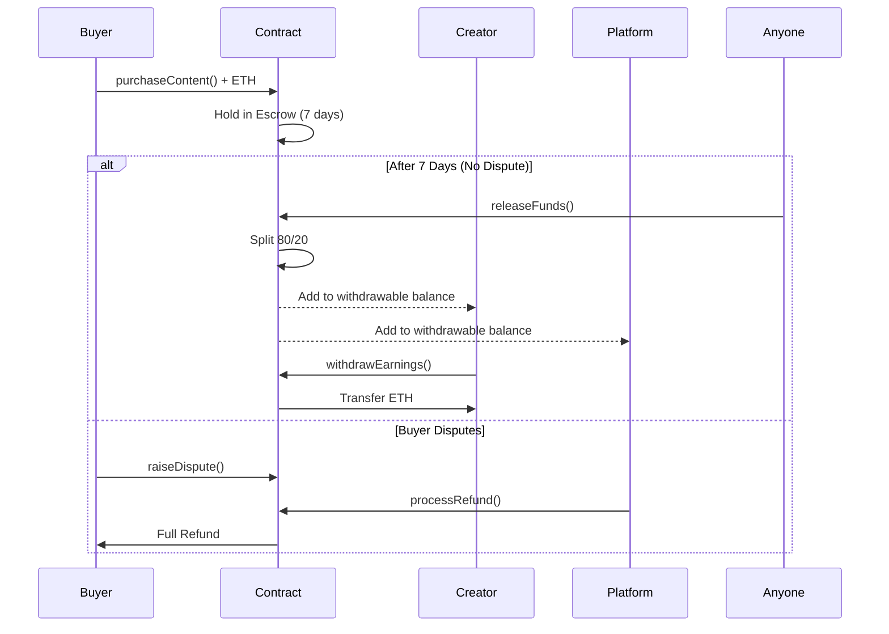

# Smart Contract Integration Guide

## Overview

The TinglePayments smart contract handles **direct crypto payments** for premium content purchases. Users send ETH directly to the contract, which holds funds in escrow, automatically splits revenue, and allows creators to withdraw earnings.

## Key Features

### 🔒 **Escrow Protection**
- Funds held for 7 days after purchase
- Buyers can dispute during escrow period
- Automatic release after escrow expires

### 💰 **Revenue Split**
- **80%** goes to creator
- **20%** goes to platform
- Automatic calculation and distribution

### ✅ **Secure Withdrawals**
- Creators withdraw released earnings anytime
- Reentrancy protection on all withdrawals
- Platform collects fees separately

### 🛡️ **Dispute Resolution**
- Buyers can raise disputes within 7 days
- Platform reviews and processes refunds
- Full refund returned to buyer if approved

## Payment Flow



## Integration Steps

### 1. Deploy Contract

Follow instructions in `DEPLOYMENT_GUIDE.md` to deploy on Base Testnet using Remix.

### 2. Update Contract Address

```typescript
// In src/lib/blockchain.ts (line 23)
const CONTRACT_ADDRESS = "0xYourDeployedContractAddress";
```

### 3. Frontend Integration

```typescript
import { purchaseContentOnChain } from '@/lib/blockchain';

// User purchases content
async function handlePurchase() {
  try {
    const result = await purchaseContentOnChain(
      creatorWalletAddress,
      contentId,
      "0.01" // Amount in ETH
    );
    
    console.log('Purchase successful!');
    console.log('Transaction:', result.txHash);
    console.log('Reference:', result.transactionRef);
    
    // Grant content access in your database
    await grantAccess(result.transactionRef);
    
  } catch (error) {
    console.error('Purchase failed:', error);
  }
}
```

### 4. Backend Integration

```typescript
import { supabase } from '@/integrations/supabase/client';

// Listen for on-chain purchase events
async function grantAccess(transactionRef: string) {
  // Store blockchain transaction reference
  const { error } = await supabase
    .from('media_purchases')
    .insert({
      buyer_id: userId,
      media_id: contentId,
      price_paid: priceInUSD,
      blockchain_hash: transactionRef
    });
  
  if (error) throw error;
}
```

### 5. Creator Withdrawals

```typescript
import { withdrawCreatorEarnings, getCreatorWithdrawableBalance } from '@/lib/blockchain';

// Check withdrawable balance
async function checkBalance() {
  const balance = await getCreatorWithdrawableBalance(creatorAddress);
  console.log('Available:', ethers.formatEther(balance), 'ETH');
}

// Withdraw earnings
async function withdraw() {
  const txHash = await withdrawCreatorEarnings();
  console.log('Withdrawal successful:', txHash);
}
```

## Important Functions

### For Buyers

**`purchaseContent(creator, contentId)`**
- Send ETH with transaction to purchase content
- Returns transaction hash and reference
- Funds held in escrow for 7 days

**`raiseDispute(transactionRef)`**
- Raise dispute within escrow period
- Only buyer can call this
- Puts purchase in disputed status

### For Creators

**`withdrawEarnings()`**
- Withdraw all released earnings
- Secure with reentrancy protection
- Can be called anytime

**`getWithdrawableBalance(creator)`**
- Check available balance to withdraw
- View function (no gas cost)

**`getTotalEarnings(creator)`**
- Check lifetime total earnings
- View function (no gas cost)

### For Platform

**`releaseFunds(transactionRef)`**
- Release funds after escrow period
- Anyone can call (permissionless)
- Automatically splits 80/20

**`processRefund(transactionRef)`**
- Process refund for disputed purchase
- Only platform wallet can call
- Returns full amount to buyer

## Security Considerations

### ✅ **Built-in Protections**
- Reentrancy guards on all withdrawals
- Checks-Effects-Interactions pattern
- Access control for sensitive functions
- Input validation on all parameters

### ⚠️ **Best Practices**
- Always test on testnet first
- Start with small amounts
- Monitor contract events
- Set up error handling
- Use hardware wallet for platform wallet

### 🔍 **Verification**
- Verify contract on BaseScan
- Monitor all transactions
- Set up event notifications
- Keep audit logs

## Testing Checklist

Before going to production:

- [ ] Deploy to Base Sepolia testnet
- [ ] Test purchase with 0.001 ETH
- [ ] Wait 7 days and test fund release
- [ ] Test dispute mechanism
- [ ] Test refund process
- [ ] Test creator withdrawal
- [ ] Test platform fee withdrawal
- [ ] Verify all events are emitted correctly
- [ ] Test with multiple concurrent purchases
- [ ] Verify gas costs are acceptable
- [ ] Check all error messages work
- [ ] Test with different wallet providers

## Gas Optimization

The contract is optimized for gas efficiency:

- ✅ Packed storage variables
- ✅ Efficient event emissions
- ✅ Minimal storage reads/writes
- ✅ No unnecessary computations
- ✅ Single transaction for purchases

## Monitoring & Alerts

Set up monitoring for:

1. **Purchase Events** - Track all new purchases
2. **Dispute Events** - Alert on new disputes
3. **Large Transactions** - Flag unusual amounts
4. **Failed Transactions** - Monitor for errors
5. **Contract Balance** - Ensure proper escrow

## Support & Resources

- **Contract Code**: `contracts/TinglePayments.sol`
- **Deployment Guide**: `contracts/DEPLOYMENT_GUIDE.md`
- **Integration Code**: `src/lib/blockchain.ts`
- **Base Docs**: https://docs.base.org
- **BaseScan**: https://sepolia.basescan.org

## Troubleshooting

### Transaction Fails
- Check ETH amount is sufficient
- Verify contract address is correct
- Ensure OKX Wallet is on Base network
- Check gas limit is adequate

### Withdrawal Fails
- Verify funds have been released from escrow
- Check withdrawable balance > 0
- Ensure sufficient gas for transaction

### Can't Dispute
- Check if still within escrow period
- Verify you are the buyer
- Ensure purchase status is "Pending"

---

**Need Help?** Check the detailed comments in the smart contract code or refer to the deployment guide.
